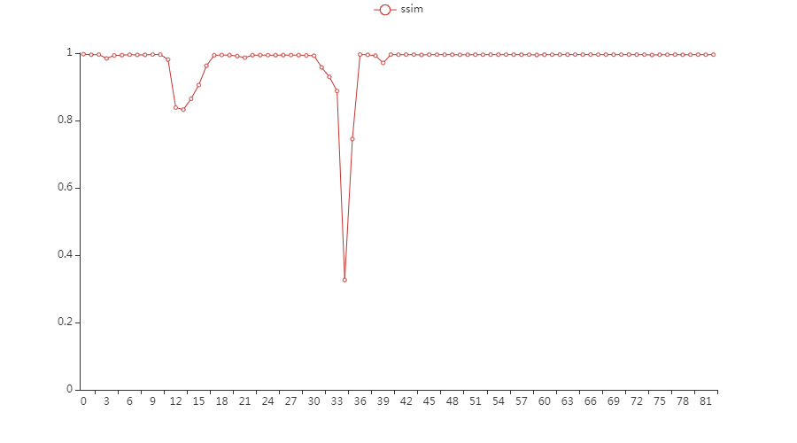

<h1 align="center">stage sep(aration) x</h1>

    <em>detect stages in video automatically</em>

---

---

## 目标

- 视频阶段划分
- 视频帧级别的分类

## 实现原理

### 核心

核心算法围绕着 SSIM 展开。[SSIM介绍](https://zh.wikipedia.org/wiki/%E7%B5%90%E6%A7%8B%E7%9B%B8%E4%BC%BC%E6%80%A7)

应明确，两张图片的SSIM可以一定程度上描述他们的相似度（变化程度），即他们是否发生了变化。那么以此类推，如果在一段连续图片上应用该方法，我们即可衡量该阶段内的变化情况。

而，视频即是由连续图片组成的。如果计算一段视频相邻帧的SSIM变化趋势，我们可以发现一些规律：

可以看到，实际上每当图像发生变化时，ssim数值会有明显的下跌；而当画面趋于平稳，ssim会回到接近1的位置。那么我们可以得到结论：

- 波谷区间对应视频的变化区间
- 平缓区间对应视频的稳定区间
- 波谷深度对应变化的剧烈程度

### 架构与流程

为了满足不同的使用需求，stagesepx主要由两个概念组成：

- 切割器
- 分类器

#### 切割器

顾名思义，切割器的功能是将一个视频按照一定的规律切割成多个部分。

例如，根据上述的思想，我们能够切割并提取视频中的稳定区间。得到稳定区间之后，我们可以很轻易地知道视频中有几个稳定阶段、提取稳定阶段对应的帧等等。

切割器的定位是预处理，降低其他模块的运作成本及重复度。

#### 分类器

针对上面的例子，分类器应运而生。它主要是加载（在AI分类器上可能是学习）一些分类好的图片，并据此对帧（图片）进行分类。

例如，当加载上述例子中稳定阶段对应的帧后，分类器即可将视频进行帧级别的分类，得到每个阶段的准确耗时。

分类器的定位是高准确度的图片分类，它应该有不同的存在形态（例如机器学习模型）、以达到不同的分类效果。stagesep2本质上是一个分类器。

### 性能与效率

stagesep2 遇到的致命问题就是，它太慢了，即便效率对于该类项目来说并不是优先级很高。这导致了它在生产环境中必须在准确性与效率中做取舍。

除了常规的基于图像本身的优化手段，stagesepx主要利用采样机制进行性能优化，它指把时间域或空间域的连续量转化成离散量的过程。由于分类器的精确度要求较高，该机制更多被用于切割器部分，用于加速切割过程。它在计算量方面优化幅度是非常可观的，以5帧的步长为例，它相比优化前节省了80%的计算量。

当然，采样相比连续计算会存在一定的误差，如果你的视频变化较为激烈或者你希望有较高的准确度，你也可以关闭采样功能。

### 稳定性

stagesep2存在的另一个问题是，对视频本身的要求较高，抗干扰能力不强。这主要是它本身使用的模块（template matching、OCR等）导致的，旋转、分辨率、光照都会对识别效果造成影响；由于它强依赖预先准备好的模板图片，如果模板图片的录制环境与视频有所差异，很容易导致误判的发生。

而SSIM本身的抗干扰能力相对较强。如果使用默认的SSIM分类器，所有的数据（训练集与测试集）都来源于同一个视频，保证了环境的一致性，规避了不同环境（例如旋转、光照、分辨率等）带来的影响，大幅度降低了误判的发生。

## License

[MIT](LICENSE)
