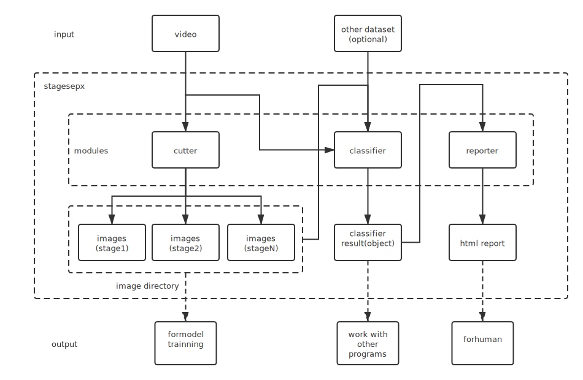

<h1 align="center">
  
</h1>

<h3 align="center">stage sep(aration) x</h3>
<p align="center">
    <em>detect stages in video automatically</em>
</p>

---

| Type                 | Status                                                                                                                                                                                            |
|----------------------|--------------------------------------------------------------------------------------------------------------------------------------------------------------------------------------------------|
| package version      | [](https://badge.fury.io/py/stagesepx)                                                                                                    |
| python version       |                                                                                                                        |
| auto test            |                                                                                                               |
| code maintainability | [](https://codeclimate.com/github/williamfzc/stagesepx/maintainability)                            |
| code coverage        | [](https://codecov.io/gh/williamfzc/stagesepx)                                                               |
| docker build status  |   |
| code style           | [](https://github.com/psf/black)                                                                                 |

---

> For English users:
>
> Mainly we used Chinese in discussions and communications, so maybe the most of issues/document are wrote in Chinese currently.
>
> But don't worry:
> - maybe google translate is a good helper :)
> - read the code directly (all the code and comments are wrote in English)
> - feel free to contact with us via building a new issue with your questions
>
> Thanks !

---

This video shows the complete startup process of an app: 


By sending this video to stagesepx, you would get a report like this automatically:


You can get the exact time consumption for each stage easily. Of course it is cross-platform, which can be also used in Android/Web/PC or something like that. Even, any platforms:


And precisely:


As you can see, its result is very close to the timer.

---

- Fully automatic, no pre-training required
- Less code required
- Configurable for different scenes
- All you need is a video!

## Structure



## Quick Start

> Translation is working in progress. But not ready. You can use something like google translate instead for now. Feel free to leave me a issue when you are confused.

- [30 lines demo](example/mini.py)
- [how to use it in production (in Chinese)](https://github.com/williamfzc/stagesepx/blob/master/README_en.md)
- [demo with all the features (in Chinese)](example/cut_and_classify.py)
- [i have some questions](https://github.com/williamfzc/stagesepx/issues/new)

## Installation

```bash
pip install stagesepx
```

## License

[MIT](LICENSE)

[](https://app.fossa.io/projects/git%2Bgithub.com%2Fwilliamfzc%2Fstagesepx?ref=badge_large)
