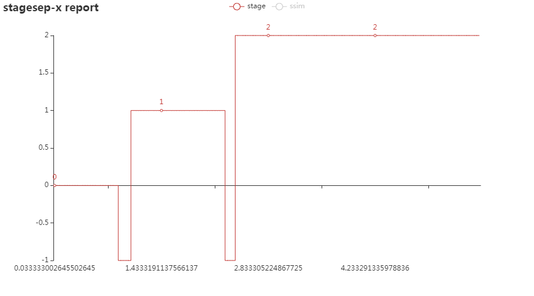

# 运作方式

!> stagesepx主要由三个部分组成：切割器、分类器、hook。

## 切割器

?> 切割器是 stagesepx 最重要的组成部分，是整个过程能够被自动化的基石。

顾名思义，切割器的功能是将一个视频按照一定的规律切割成多个部分。他负责视频阶段划分与采样，作为数据采集者为其他工具（例如AI模型）提供自动化的数据支持。它应该提供友好的接口或其他形式为外部（包括分类器）提供支持。例如，`pick_and_save`方法完全是为了能够使数据直接被 [keras](https://github.com/keras-team/keras) 利用而设计的。

切割器的定位是预处理，降低其他模块的运作成本及重复度。得到稳定区间之后，我们可以知道视频中有几个稳定阶段、提取稳定阶段对应的帧等等。在此基础上，你可以很轻松地对阶段进行图片采样（例子中为每个阶段采集3张图片，一共有3个稳定阶段，分别名为0、1、2）后保存起来，以备他用（例如AI训练、功能检测等等）：

## 分类器

针对上面的例子，分类器应运而生。它主要是加载（在AI分类器上可能是学习）一些分类好的图片，并据此对帧（图片）进行分类。

例如，当加载上述例子中稳定阶段对应的帧后，分类器即可将视频进行帧级别的分类，得到每个阶段的准确耗时。

分类器的定位是对视频进行帧级别、高准确度的图片分类，并能够利用采样结果。它应该有不同的存在形态（例如机器学习模型）、以达到不同的分类效果。例如，你可以在前几次视频中用采样得到的数据训练你的AI模型，当它收敛之后在你未来的分析中你就可以直接利用训练好的模型进行分类，而不需要前置的采样过程了。[stagesep2](https://github.com/williamfzc/stagesep2)本质上是一个分类器。

目前，stagesepx官方提供了两种不同类型的分类器，用于处理切割后的结果：

- SVM + HoG分类器在阶段复杂的视频上表现较好，你可以用不同的视频对它进行训练逐步提高它的识别效果，使其足够被用于生产环境；
- 传统的 SSIM 分类器无需训练且较为轻量化，多用于阶段较少、较为简单的视频；

## hook

hook是在 0.4.2 版本之后被加入的概念，它被用于支撑**帧级别**的图像处理。换言之，所有对帧的操作都会通过hook来实现。你可以发现，cutter与classifier内部的图片压缩、图片灰度化都是通过hook的形式实现的。

以 cutter 为例，在初始化时，CompressHook 与 GreyHook 会被加入 hook_list 中。在加入后，每当 cutter 开始处理一帧之前，首先会将帧依次经过 hook_list 处理，在所有的 hook 处理完毕之后才会进行正式的分析流程。例如，在加入 CompressHook 之后，每一帧在进行处理之间都会经过它的压缩。

如此做，我们能够非常灵活地定制预处理步骤的行为。hook 不仅仅只能影响分析流程，你完全可以通过定制 hook 进行个性化的帧操作。例如 FrameSaveHook 能够在迭代过程中将每一帧单独保存到指定位置。你可以参考他们的实现来完成属于自己的hook，从而实现你的功能。

!> hook的执行是严格按照添加的顺序的，hook之间可能会存在干扰。overwrite参数被用于控制hook是否会修改原始的帧，具体使用可参考 [完整例子](https://github.com/williamfzc/stagesepx/blob/master/example/cut_and_classify.py)。

## 设计理念与定位

?> stagesepx的定位是，轻量化的、基于图像处理与机器学习的、全自动的视频分析工具。

为了兼顾上述特点（轻量化的AI），我们希望它能够在保证效果的情况下在大多数平台上无痛运行，能够被快速部署，这也意味着它不能有过于苛刻的依赖项（软件与硬件）。除此之外，深度学习需要大量的训练集，而这个量级是单一视频难以提供的。基于这些前提，我们放弃了笨重的深度学习框架而选择了 [sklearn](https://github.com/scikit-learn/scikit-learn)。事实上，对于短视频（30s内）而言，这个包的功能已经非常足够。

当然，**这不意味着你不能使用深度学习来进行分类**，毕竟深度学习的效果理论上要比普通的机器学习算法好得多。你完全可以利用 `cut.py` 得到的结果来训练你的深度学习模型。详见 [这里](/pages/1_where_can_it_be_used?id=as-ai-frontend)。

另一方面，你也可以不使用 cutter，而是使用人工采集的训练集来训练你的模型，分析你的视频。详见 [这里](https://github.com/williamfzc/stagesepx/tree/master/example)。
